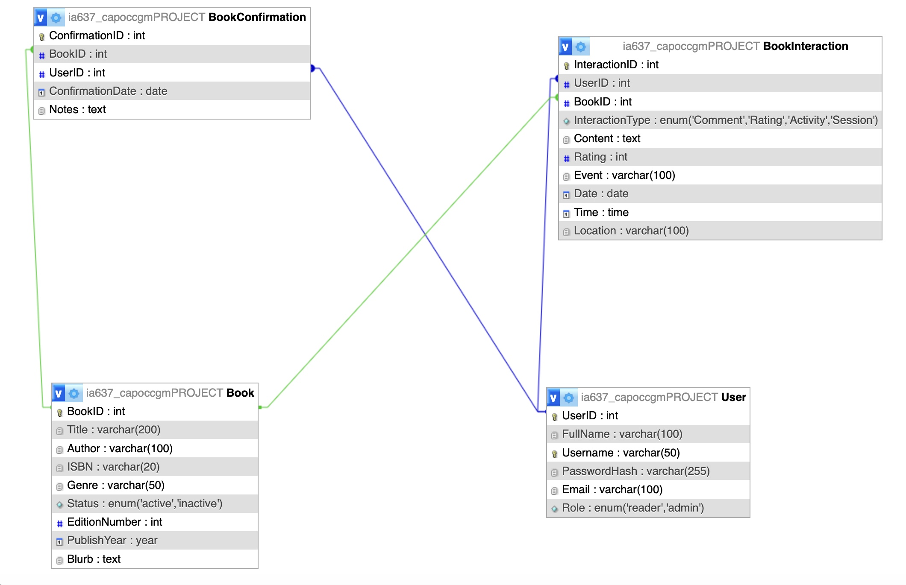
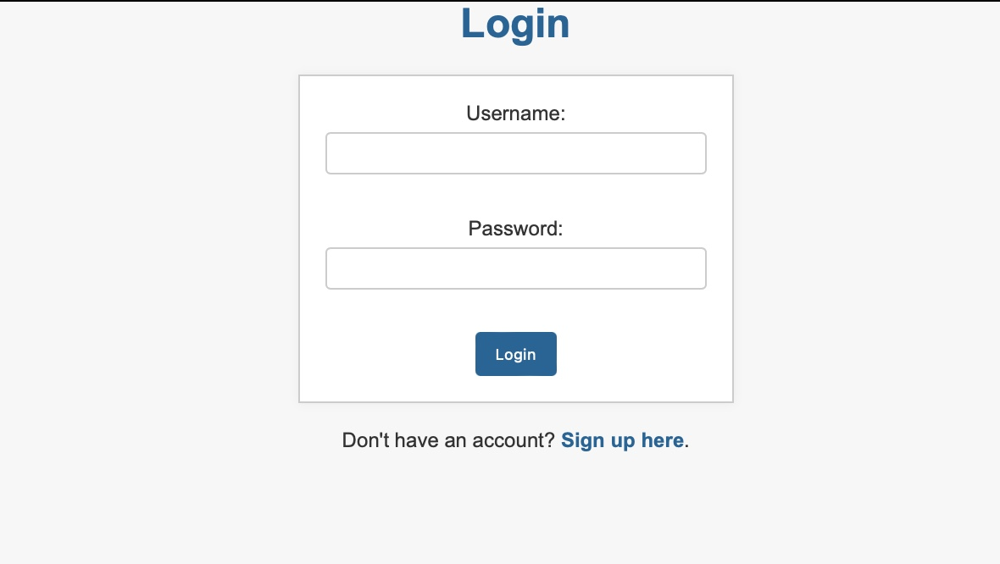
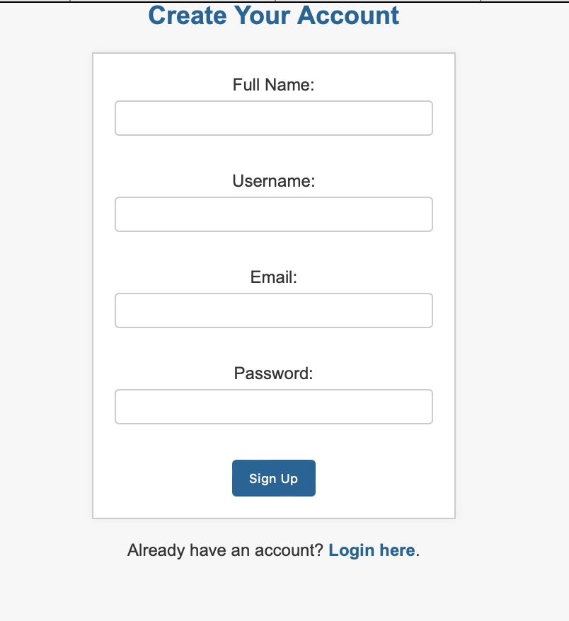
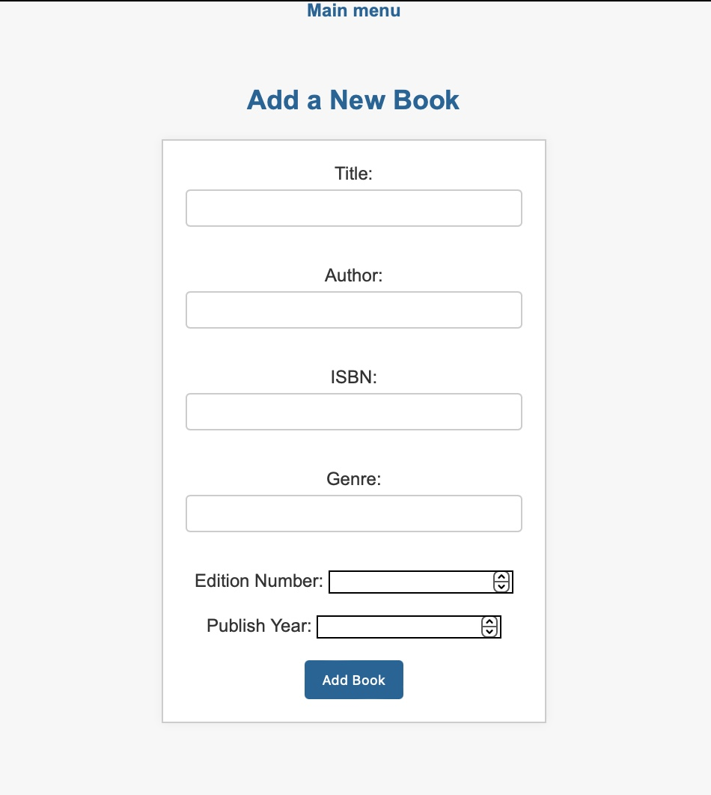
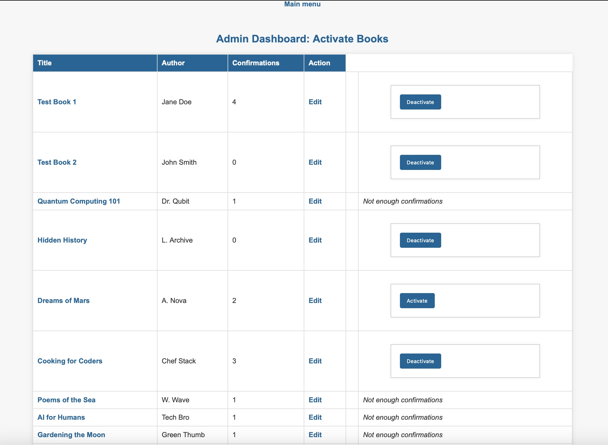
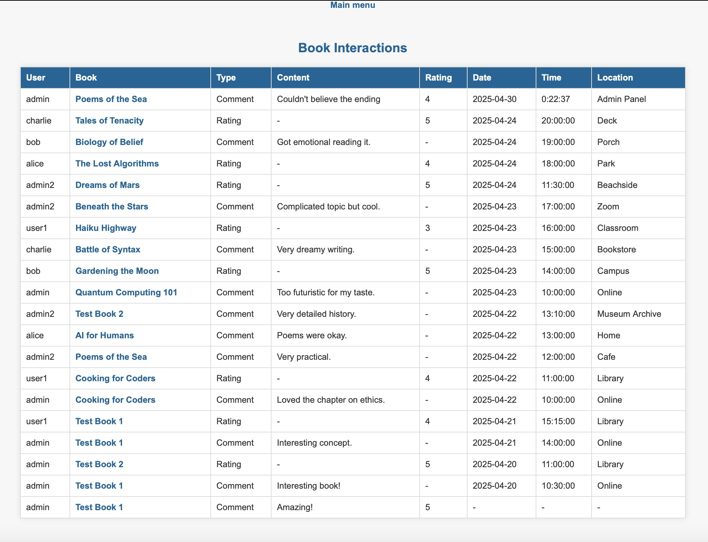
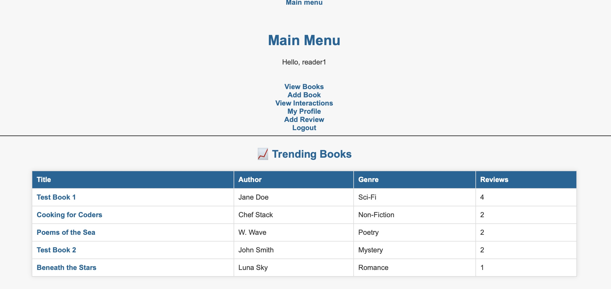

**Student:** Gianna Capoccia  
**Course:** IA637 – Final Project  
**Team:** Solo Project  

# 📚 Book Club Management System 


## Project Description
The Book Club Management System is an interactive platform designed to manage and enhance the experience of book club members and administrators. It facilitates effective member management, book discussions, and session planning, while also offering advanced features like personalized book recommendations and analytics.

---

## Application Purpose

### Member Management
- **Members** can create and manage their profiles.
- **Administrators** can approve members, assign roles, and manage memberships.

### Book Management
- **Members** can suggest books.
- **Administrators** can add, update, or remove books from the club's reading list.

### Reading Sessions
- Schedule and manage reading sessions.
- Members can RSVP to sessions and access session details.

### Discussion Forums
- Facilitate book discussions online.
- Members can post comments, and moderators can manage discussions.

### Analytics Dashboard
- Track most-read books, active members, and reading trends.
- Provide insights for administrators to improve club engagement.

---

## Technology Stack

- **Backend**: Flask  
- **Frontend**: HTML/CSS  
- **Database**: MySQL  

---

## User Guide

- **Administrators** can log in to manage books, sessions, and user roles.
- **Members** can log in to suggest books, join sessions, and participate in discussions.
- Navigate through the application using the menu options available on the home page.

---

## CRUD Operations

- **Users** and **Books** tables support full CRUD operations.
- **Sessions** support create, read, and update operations.
- **Comments** can be created, read, and deleted.
- **BookActivityLog** primarily reads but can be updated as needed.

---

## Relational Diagram



---

## 🧾 Table Descriptions 

### **User**
| Field         | Type              | Description                               |
|---------------|-------------------|-------------------------------------------|
| `UserID`      | `int` (PK)        | Unique identifier for each user           |
| `FullName`    | `varchar(100)`    | Full name of the user                     |
| `Username`    | `varchar(50)`     | Unique login username                     |
| `PasswordHash`| `varchar(255)`    | Hashed user password                      |
| `Email`       | `varchar(100)`    | Email address                             |
| `Role`        | `enum('reader','admin')` | User's system role                   |

### **Book**
| Field           | Type             | Description                                  |
|------------------|------------------|----------------------------------------------|
| `BookID`         | `int` (PK)        | Unique identifier for each book              |
| `Title`          | `varchar(200)`    | Book title                                   |
| `Author`         | `varchar(100)`    | Author(s) of the book                        |
| `ISBN`           | `varchar(20)`     | International Standard Book Number           |
| `Genre`          | `varchar(50)`     | Literary genre                               |
| `Status`         | `enum('active','inactive')` | Current availability status         |
| `EditionNumber`  | `int`             | Edition number                               |
| `PublishYear`    | `year`            | Year the book was published                  |
| `Blurb`          | `text`            | Optional back-cover style summary            |

### **BookInteraction**
| Field             | Type                               | Description                                |
|------------------|------------------------------------|--------------------------------------------|
| `InteractionID`  | `int` (PK)                          | Unique interaction entry                   |
| `UserID`         | `int` (FK)                          | The user who made the interaction          |
| `BookID`         | `int` (FK)                          | The book that was interacted with          |
| `InteractionType`| `enum('Comment','Rating','Activity','Session')` | Type of interaction      |
| `Content`        | `text`                              | Textual content (e.g., comment)            |
| `Rating`         | `int`                               | Optional rating (out of 5)                 |
| `Event`          | `varchar(100)`                      | Event label (e.g., source of interaction)  |
| `Date`           | `date`                              | Date of interaction                        |
| `Time`           | `time`                              | Time of interaction                        |
| `Location`       | `varchar(100)`                      | Context or place of interaction            |

### **BookConfirmation**
| Field             | Type            | Description                                  |
|------------------|------------------|----------------------------------------------|
| `ConfirmationID` | `int` (PK)        | Unique ID for confirmation entry             |
| `BookID`         | `int` (FK)        | The book being confirmed                     |
| `UserID`         | `int` (FK)        | The user submitting confirmation             |
| `ConfirmationDate` | `date`         | Auto-filled date of confirmation             |
| `Notes`          | `text`            | Optional reasoning or justification          |

---

## Book Interaction & Review System

This Flask-based client/server web application allows users to **submit, browse, confirm, and review books** using a clean object-oriented backend connected to MySQL. Admins can confirm books, activate entries, and override or edit any information submitted by users.

---

## 👥 User Roles

- **Admin**:
  - Confirm, activate, and manage book entries
  - Override any data entered by users
  - Access analytics and interaction reports

- **Reader**:
  - Sign up and log in
  - Add books (default inactive)
  - Submit ratings, reviews, confirmations
  - Edit own profile
  - View trending books

---



## 🔑 Authentication

- Users register with full name, username, email, and password  
- Passwords are hashed using `bcrypt`  
- Sessions are managed securely with Flask

📸  


---

## ✍️ Features

### Book Management
- Readers can add new titles (inactive)


📸  


- Admins can edit, activate, or delete any book



### Interactions & Reviews
- Add comments, ratings
- Track date, time, location of interaction

📸  


### Confirmations
- Readers confirm books
- Admins see confirmation count and can activate titles


### Trending Section
- Top 5 books by interaction count displayed on user dashboard

📸  


### Profile Page
- Readers and admin can view & update their info
- Lists books the reader interacted with

📸  


---

## 🧠 SQL Queries

### 1. Trending Books

```sql
SELECT b.*, COUNT(i.InteractionID) AS InteractionCount
FROM Book b
LEFT JOIN BookInteraction i ON b.BookID = i.BookID
GROUP BY b.BookID
ORDER BY InteractionCount DESC
LIMIT 5;
```

### 2. Book Interactions with Users

```sql
SELECT bi.*, b.Title, u.Username
FROM BookInteraction bi
JOIN Book b ON bi.BookID = b.BookID
JOIN User u ON bi.UserID = u.UserID
ORDER BY bi.Date DESC, bi.Time DESC;
```

### 3. Confirmation Analytics

```sql
SELECT b.BookID, b.Title, b.Author, b.Status, COUNT(c.ConfirmationID) AS ConfirmCount
FROM Book b
LEFT JOIN BookConfirmation c ON b.BookID = c.BookID
GROUP BY b.BookID, b.Title, b.Author, b.Status;
```

---

## 🧱 Tech Stack

- **Backend**: Flask (Python)
- **Database**: MySQL
- **Frontend**: HTML + Jinja2
- **Auth**: bcrypt
- **Session**: Flask sessions

---

## 📁 Project Structure

```
project-root/
├── app.py
├── user.py, book.py, etc.
├── templates/
│   ├── .html files
├── static/
│   ├── style.css
├── config.yml
├── init_schema.sql   ← SQL schema initialization script
├── screenshots/
└── README.md

```

---

---

## 🎨 Styling (CSS)

The app includes a custom `style.css` located in the `/static/` folder.

- Centers all text and form content
- Applies modern, soft background and font styling
- Highlights headings and buttons in a calming blue
- Enhances form layout and table readability


## 🧪 Test Credentials

| Role   | Username | Password    |
|--------|----------|-------------|
| Admin  | admin    | admin123    |
| Reader | reader1  | readerpass  |

---

## ▶️ How to Run

1. Clone the repository  
2. Initialize DB with provided schema  
3. Update `config.yml`  
4. Run locally:

```bash
python3 app.py
```

Visit: `http://127.0.0.1:5000`

---

## 🎯 Use Cases Covered

- ✅ Secure reader and admin login  
- ✅ Book approval flow  
- ✅ Trending & interaction tracking  
- ✅ Custom profile editing  
- ✅ Admin override and full control  

---

## 📌 Final Notes

This project satisfies all final project criteria:  
✔️ 5 tables  
✔️ Full CRUD + joins  
✔️ Role-based logic  
✔️ Custom SQL  
✔️ Admin tools  
✔️ Dashboard analytics  
✔️ Security & usability features  
✔️ Professional screen flow

## 📋 Rubric Checklist

| Requirement                         | Completed? | Notes                                                                 |
|-------------------------------------|------------|-----------------------------------------------------------------------|
| 4–5 tables                          | ✅          | User, Book, BookInteraction, BookConfirmation, Blurb (as field)       |
| Login system                        | ✅          | bcrypt hashing, session tracking                                     |
| Full CRUD for 2+ tables             | ✅          | Books and Users – create, read, update, delete                       |
| 3+ custom SQL JOIN pages            | ✅          | Trending Books, Interactions, Confirmations                          |
| Logical flow, no dead ends          | ✅          | All links tested and active                                          |
| Business logic enforced             | ✅          | Duplicates blocked, admin-only routes protected                      |
| Markdown Readme w/ details          | ✅          | This file                                                             |
| Admin/user test credentials         | ✅          | Provided in section above                                             |
| Screenshots of key functionality    | ✅          | Embedded across the README                                            |
| Profile editing and book tracking   | ✅          | Reader profile shows books interacted with                           |
| Admin override/edit logic           | ✅          | Admins can update books, override user data                          |


## 🚧 Known Issues or Future Work

While the application meets all rubric requirements and performs as expected, the following enhancements or known limitations are noted for potential future development:

### ✅ Known Issues
- **Minimal styling**: Pages are functional but use basic CSS. Improved UI/UX could enhance usability and aesthetics.
- **Duplicate book checking logic**: Relies on title, author, or ISBN, which could miss edge cases (e.g., same title, different editions).
- **Confirmation thresholds**: Currently, there is no automated logic for how many confirmations are needed to activate a book—it is up to admin discretion.
- **Role enforcement via database only**: No UI-based enforcement prevents a user from being changed to an admin manually (assumed instructor control).

### 💡 Future Features
- **Image support**: Allow users to upload book covers or profile photos.
- **Session scheduling system**: Add calendar integration or RSVP tracking for book club sessions.
- **Comment threading**: Enable users to reply to other reviews or confirmations.
- **Notification system**: Email alerts for admins or users when books are confirmed or reviews are posted.
- **Search functionality**: Filter books by title, genre, or author in the “View Books” page.

These improvements would help take the platform from a course project to a more production-ready system.

