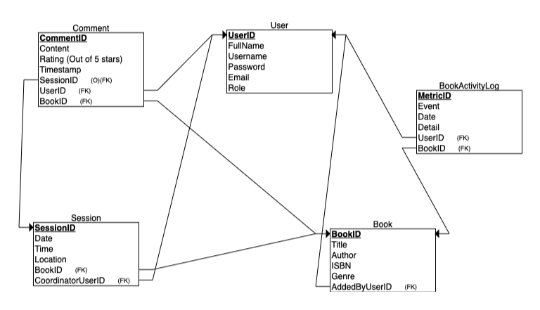

# Book Club Management System

## Project Description
The Book Club Management System is an interactive platform designed to manage and enhance the experience of book club members and administrators. It facilitates effective member management, book discussions, and session planning, while also offering advanced features like personalized book recommendations and analytics.

## Application Purpose
### Member Management
- **Members** can create and manage their profiles.
- **Administrators** can approve members, assign roles, and manage memberships.

### Book Management
- **Members** can suggest books.
- **Administrators** can add, update, or remove books from the club's reading list.

### Reading Sessions
- Schedule and manage reading sessions.
- Members can RSVP to sessions and access session details.

### Discussion Forums
- Facilitate book discussions online.
- Members can post comments, and moderators can manage discussions.

### Analytics Dashboard
- Track most-read books, active members, and reading trends.
- Provide insights for administrators to improve club engagement.

## Technology Stack
- **Backend**: Flask
- **Frontend**: HTML/CSS
- **Database**: SQL

## User Guide
- **Administrators** can log in to manage books, sessions, and user roles.
- **Members** can log in to suggest books, join sessions, and participate in discussions.
- Navigate through the application using the menu options available on the home page.

## CRUD Operations
- **Users** and **Books** tables support full CRUD operations.
- **Sessions** support create, read, and update operations.
- **Comments** can be created, read, and deleted.
- **BookActivityLog** primarily reads but can be updated as needed.

## Relational Diagram

### Users
- **Table Name**: Users
- **Purpose**: Manages information about all members and administrators of the book club.
- **Fields**:
  - **UserID** (PK): Unique identifier for each user.
  - **FullName**: Full name of the user.
  - **Username**: Chosen username for login purposes.
  - **Password**: Encrypted password for secure access.
  - **Email**: User's email address for communication and notifications.
  - **Role**: Defines the user's role within the club (Member/Admin).

### Books
- **Table Name**: Books
- **Purpose**: Contains all details about the books listed in the book club's catalog.
- **Fields**:
  - **BookID** (PK): Unique identifier for each book.
  - **Title**: The title of the book.
  - **Author**: Author(s) of the book.
  - **ISBN**: International Standard Book Number for the book.
  - **Genre**: Literary genre of the book.
  - **AddedByUserID** (FK): The user who added the book to the system.

### Sessions
- **Table Name**: Sessions
- **Purpose**: Manages the scheduling and coordination of reading sessions.
- **Fields**:
  - **SessionID** (PK): Unique identifier for each session.
  - **Date**: The date on which the session is scheduled.
  - **Time**: Time at which the session starts.
  - **Location**: Physical or virtual location of the session.
  - **BookID** (FK): The book to be discussed in the session.
  - **CoordinatorUserID** (FK): The user responsible for coordinating the session.

### Comments
- **Table Name**: Comments
- **Purpose**: Facilitates discussion by allowing users to post comments on books and sessions.
- **Fields**:
  - **CommentID** (PK): Unique identifier for each comment.
  - **Content**: The textual content of the comment.
  - **Rating** (Optional): User-given rating out of 5 stars, applicable if the comment is a review.
  - **Timestamp**: The date and time the comment was posted.
  - **SessionID** (FK, Optional): The session to which the comment is related, if any.
  - **UserID** (FK): The user who posted the comment.
  - **BookID** (FK, Optional): The book to which the comment is related, if not session-specific.

### BookActivityLog Details
- **Table Name**: BookActivityLog
- **Purpose**: Records detailed user interactions related to books to enhance user experience and provide personalized content.
- **Fields**:
  - **MetricID** (PK): Unique identifier for each log entry.
  - **UserID** (FK): Identifies the user involved in the event.
  - **BookID** (FK): (Optional) Links to the specific book involved in the event.
  - **Event**: The type of interaction (e.g., BookRated, BookRecommended, BookSearched).
  - **Date**: The date on which the event occurred.
  - **Detail**: Describes the specifics of the event, such as rating score or recommendation reason.

